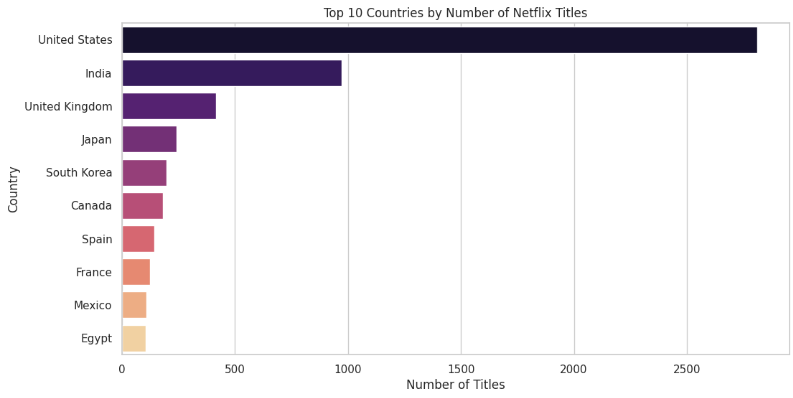
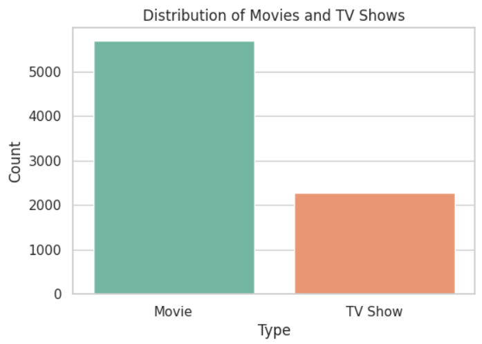
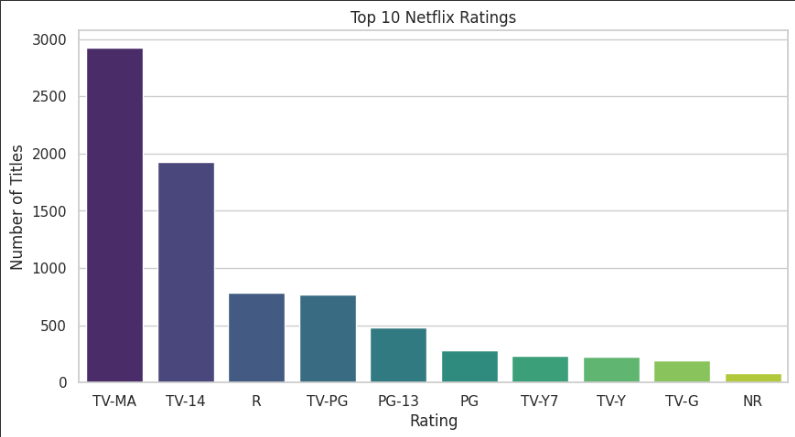
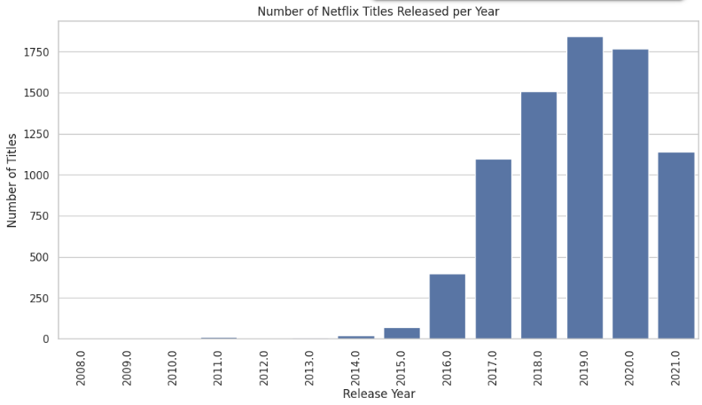

# 🎬 Netflix Titles Analysis & IMDb Rating Prediction

This project explores the Netflix Movies and TV Shows dataset using Python. It performs detailed exploratory data analysis (EDA), uncovers content trends, and simulates IMDb rating predictions using machine learning models.

---

## 📂 Dataset

Netflix Movies and TV Shows dataset downloaded from [Kaggle](https://www.kaggle.com/shivamb/netflix-shows).

---

## 📊 Visualizations

Here are some example visualizations generated in this project:

### 1️⃣ Titles by Country


### 2️⃣ Movies vs TV Shows


### 3️⃣ Titles Released per Year


### 4️⃣ Tracks Released per Year


---

## 🚀 How to Run

1️⃣ **Clone the repository**
```bash
git clone https://github.com/yourusername/Netflix_Rating_Prediction.git
2️⃣ Open the notebook
Open Netflix_Rating_Prediction.ipynb in Google Colab or Jupyter Notebook.

3️⃣ Run the notebook
Run cells step-by-step to reproduce the EDA and model training.

